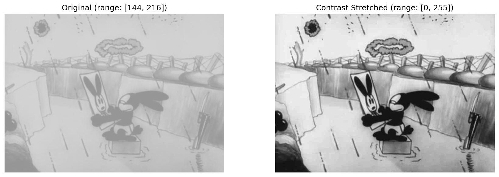
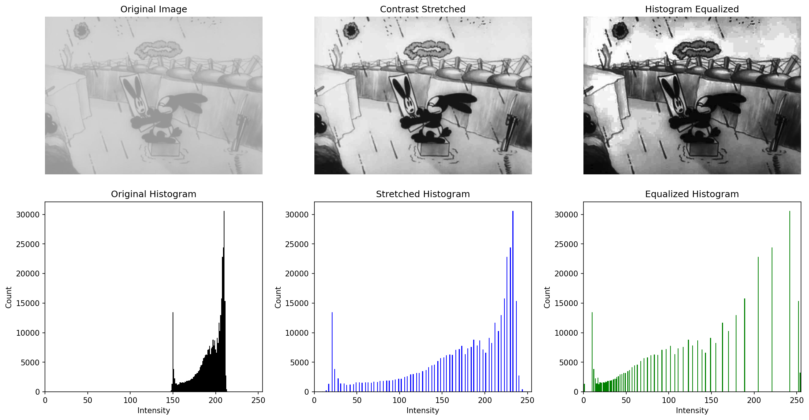
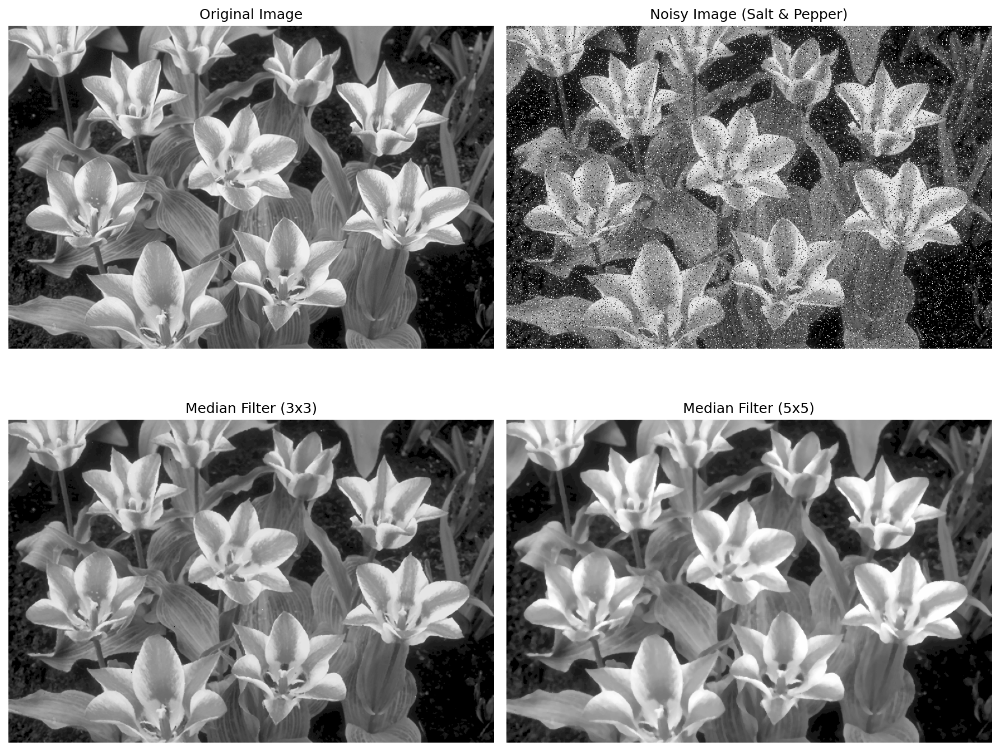
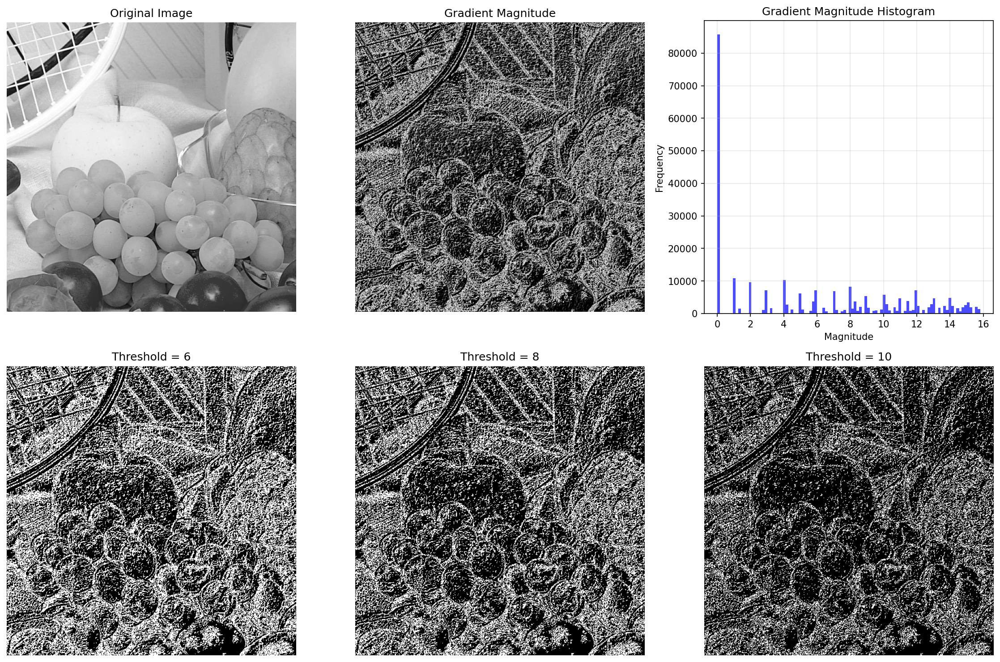
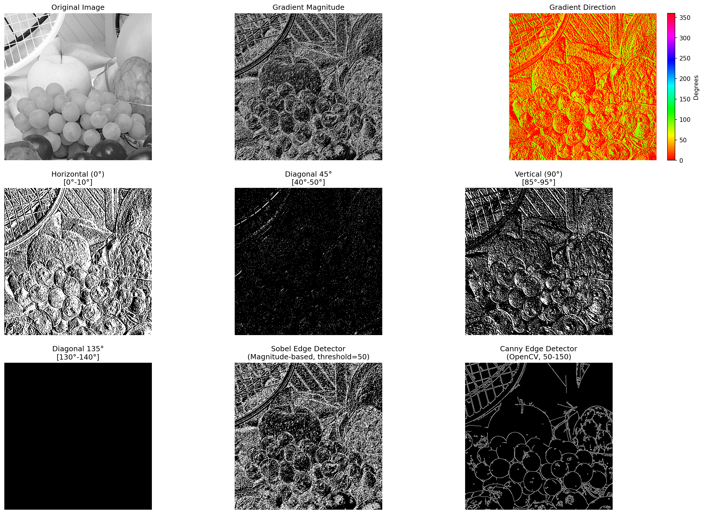
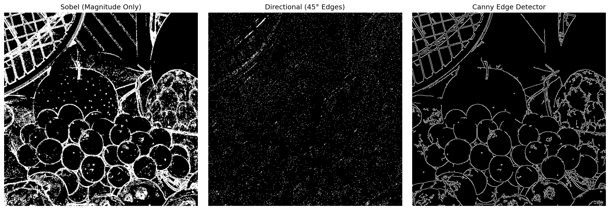

# Repository 2: Basic Image Processing

## Overview

This repository implements fundamental image processing techniques including intensity transformations, histogram equalization, non-linear filtering, and edge detection algorithms from scratch using NumPy.

## Exercise 1: Intensity Transformations and Histogram Equalization

### Files

- `contrast_stretch.py` - Linear intensity mapping
- `calculate_histogram.py` - Histogram computation
- `equalize_histogram.py` - Full histogram equalization

**Steps to Equalize Histogram:**

1. Calculate histogram and probability distribution
2. Compute cumulative distribution function (CDF)
3. Scale CDF to [0, 255] range
4. Map each pixel using the transformation function




### Analysis Results

Contrast stretching linearly spreads the intensity values across the full range, while histogram equalization redistributes pixel intensities based on the cumulative distribution function. Histogram equalization typically produces better contrast enhancement, especially for images with concentrated intensity distributions.

## Exercise 2: Non-Linear Filtering and Edge Detection

### Files

- `median_filter.py` - Non-linear median filtering
- `calculate_gradient.py` - Gradient magnitude and direction

### Functions

#### `median_filter(img, size=3)`

Applies median filter to remove salt-and-pepper noise.

**Algorithm:**

1. For each pixel, extract neighborhood window
2. Sort all values in the window
3. Replace center pixel with median value

**Usage:**

```python
from median_filter import median_filter

filtered = median_filter(noisy_img, size=5)
```

#### `calculate_gradient(img)`

Calculates gradient magnitude and direction using Sobel operators.

**Algorithm:**

1. Apply Sobel Sx and Sy filters via convolution
2. Compute magnitude: √(Gx² + Gy²)
3. Compute direction: arctan2(Gy, Gx)

**Usage:**

```python
from calculate_gradient import calculate_gradient

magnitude, angle = calculate_gradient(img)
```




### Analysis: Effect of Median Filtering on Gradient Magnitude

**Question:** What is the effect of median filtering on gradient magnitude calculation for images corrupted by salt-and-pepper noise?

**Answer:**
Median filtering significantly improves gradient magnitude calculation on noisy images:

1. **Without filtering:** Salt-and-pepper noise creates high-magnitude gradients at noise locations, resulting in a noisy gradient map with false edges.

2. **With filtering:** The median filter effectively removes impulse noise while preserving edges, producing a cleaner gradient map that accurately represents true image edges.

3. **Quantitative improvement:** The filtered gradient map has lower variance and more closely matches the gradient of the original clean image.

## Exercise 3: Simple Sobel-based Edge Detector

### Files

- `sobel_edge_detector.py` - Magnitude-based edge detection
- `directional_edge_detector.py` - Direction-based edge detection

### Functions

#### `sobel_edge_detector(img, threshold)`

Applies Sobel edge detection with binary thresholding.

**Algorithm:**

1. Calculate gradient magnitude using Sobel operators
2. Apply binary threshold to create edge map
3. Pixels above threshold → 255 (edge)
4. Pixels below threshold → 0 (non-edge)

**Usage:**

```python
from sobel_edge_detector import sobel_edge_detector

edges = sobel_edge_detector(img, threshold=50)
```

#### `directional_edge_detector(img, direction_range)`

Detects edges within a specific direction range.

**Parameters:**

- `img`: Input grayscale image
- `direction_range`: Tuple (min_angle, max_angle) in degrees
  - Example: `(40, 50)` for ~45° diagonal edges
  - 0° = horizontal right, 90° = vertical up

**Returns:** Binary directional edge map

**Usage:**

```python
from directional_edge_detector import directional_edge_detector

# Detect 45-degree diagonal edges
diagonal_edges = directional_edge_detector(img, (40, 50))

# Detect vertical edges
vertical_edges = directional_edge_detector(img, (85, 95))
```





### Analysis: Comparison of Edge Detection Methods

Three edge detection approaches were compared:

#### 1. Sobel Edge Detector (Magnitude-based)

- **Method:** Thresholds gradient magnitude only
- **Advantages:** Simple, fast, detects all edges
- **Disadvantages:**
  - Produces thick edges (no edge thinning)
  - No noise suppression
  - No edge connectivity enforcement
  - Sensitive to threshold selection

#### 2. Directional Edge Detector

- **Method:** Filters edges by gradient direction
- **Advantages:**
  - Can isolate specific orientations
  - Useful for detecting vertical, horizontal, or diagonal features
  - Good for structural analysis
- **Disadvantages:**
  - Requires knowledge of desired edge directions
  - May miss important edges outside selected range
  - Still sensitive to noise

#### 3. Canny Edge Detector (OpenCV)

- **Method:** Multi-stage sophisticated algorithm
- **Stages:**
  1. Gaussian smoothing (noise reduction)
  2. Gradient calculation
  3. Non-maximum suppression (edge thinning)
  4. Double thresholding
  5. Edge tracking by hysteresis (connectivity)
- **Advantages:**
  - Produces thin, well-connected edges
  - Excellent noise suppression
  - Better edge localization
  - More robust to parameter variation
- **Disadvantages:**
  - More computationally expensive
  - More parameters to tune

**Conclusion:** The Canny edge detector provides superior results for most practical applications due to its sophisticated multi-stage processing. The simple Sobel detector is useful for quick analysis or when computational efficiency is critical. The directional detector is valuable for applications requiring orientation-specific edge detection.
