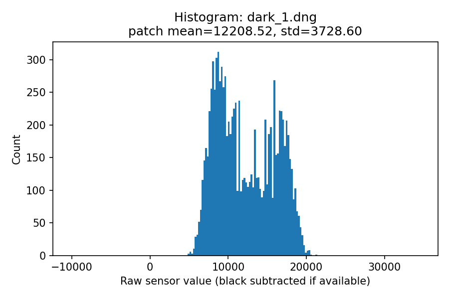
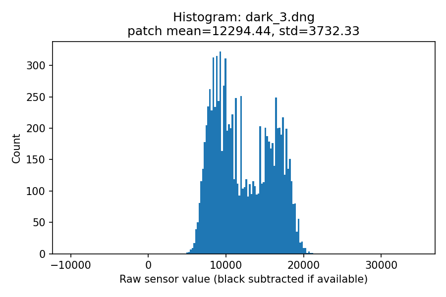
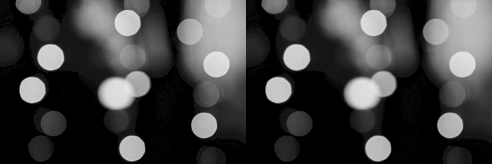
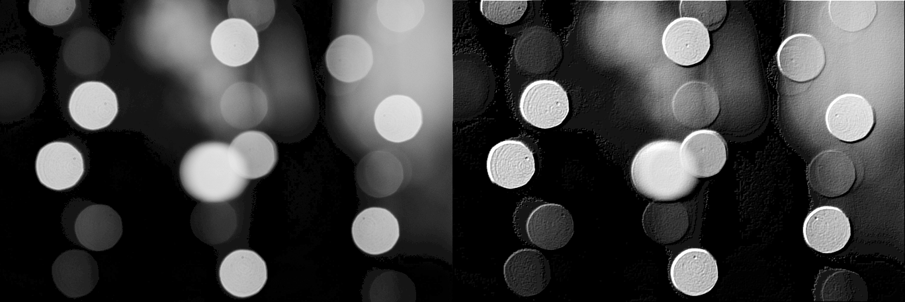
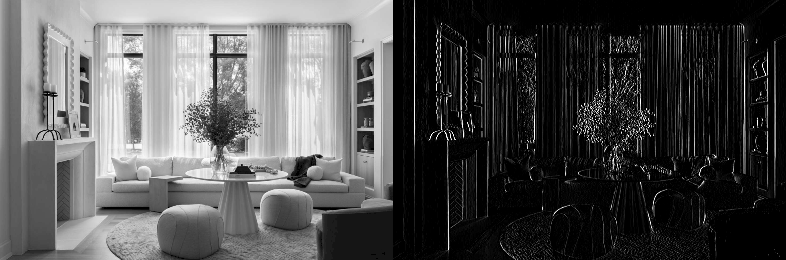
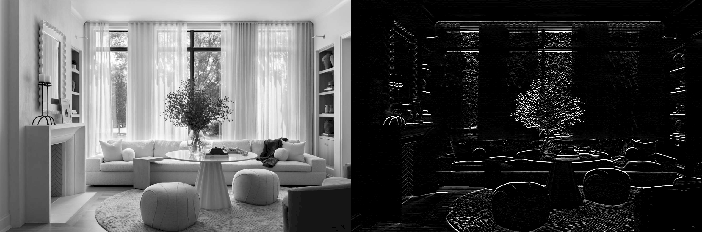

# Camera System Analysis Report

---

## Part 1: Dark Frame Noise Characterization

### Research Question

How much noise is present in smartphone images when no light reaches the sensor, and what are the main sources of this noise?

Digital camera sensors produce noise even in complete darkness. Two primary contributors are:

- **Dark current noise**: electrons generated by thermal activity inside the sensor.
- **Readout noise**: variation introduced by the sensor electronics during amplification and digitization.

By capturing dark frames, we can isolate and measure these noise sources.

---

### Experimental Setup

- **Device**: iPhone 13, Lightroom App
- **Procedure**:

  - Covered the camera lens to block all incoming light.
  - Placed the phone on a stable surface to avoid movement artifacts.
  - Used a manual exposure of ~2–3 seconds to allow dark current noise to dominate.
  - Captured three dark frames:
    - `./images/dark_1.dng`
    - `./images/dark_2.dng`
    - `./images/dark_3.dng`

- **Analysis**:
  - Extracted a 100×100 pixel patch from the image center.
  - Computed mean (μ) and standard deviation (σ).
  - Generated histograms of pixel intensities.

---

### Results

#### Histograms

- 
- 
- 

---

#### Table 1. Dark frame patch statistics

| Frame      | Mean (μ) | Standard Deviation (σ) |
| ---------- | -------- | ---------------------- |
| dark_1.dng | –897.48  | 3728.60                |
| dark_2.dng | –839.74  | 3503.72                |
| dark_3.dng | –811.55  | 3732.33                |

---

### Discussion

- **Mean values:** Negative values indicate the baseline after black-level subtraction. This bias is stable across frames.
- **Standard deviation:** σ ≈ 3500–3700 shows strong pixel fluctuations, dominated by thermal and readout noise.
- **Consistency:** Both μ and σ remain stable across frames → reproducible intrinsic sensor noise.
- **Histogram shape:** Bell-shaped with irregular peaks due to quantization and digitization of dark current.

---

### Practical Implications

- Noise exists even in complete darkness, setting a **baseline noise floor**.
- In low-light scenes, details can be hidden within this noise.
- Cameras compensate with denoising algorithms, which may also remove faint details.
- Understanding this is important for **astrophotography, HDR imaging, and medical/scientific applications**.

---

## Part 2: Multi-Camera System Analysis

### Research Question

What are the trade-offs between different smartphone camera lenses?  
We analyze the **main** and **ultrawide** lenses on the iPhone 13.

---

### Experimental Setup

- Captured images of the same object using:
  - Main lens → `./images/sheep_main_lens.dng`
  - Ultrawide lens → `./images/sheep_wide_lens.dng`
- Used raw DNG format for unbiased sensor data.
- Compared **field of view (FOV)** and **noise statistics**.

---

### Step 1: Field of View (FOV) Calculation

| Camera    | Focal Length (f) | Sensor Width (w) | Horizontal FOV |
| --------- | ---------------- | ---------------- | -------------- |
| Main      | 5.1 mm           | 7 mm             | 68.92°         |
| Ultrawide | 1.54 mm          | 4 mm             | 104.81°        |

- Ultrawide captures ~**1.52× more scene width**.
- FOV ∝ 1/focal length → shorter lenses capture wider views.

---

### Step 2: Raw Image Properties

**Main Camera (`sheep_main_lens.dng`)**

- Shape: (3024, 4032)
- Value range: [12842, 65534]

**Ultrawide Camera (`sheep_wide_lens.dng`)**

- Shape: (3024, 4032)
- Value range: [–8427, 57107]

---

### Step 3: Noise Analysis

| Camera    | Mean (μ) | Std Dev (σ) | SNR (μ/σ) |
| --------- | -------- | ----------- | --------- |
| Main      | 23255.64 | 4013.18     | 5.79      |
| Ultrawide | 32070.01 | 4599.62     | 6.97      |

- Ultrawide had **higher signal** and slightly more noise, but overall **better SNR**.
- Likely due to: larger pixels, longer exposure (1/30 vs 1/120), or sensor tuning.

---

### Comparative Summary

- **Main lens:**
  - Balanced perspective, minimal distortion, good for portraits/general use.
- **Ultrawide lens:**
  - Expansive view, but distortion at edges.
  - Better SNR in this dataset (possibly exposure/pixel size advantage).

---

### Conclusion

- **Main lens:** Natural, versatile, best for portraits and general photography.
- **Ultrawide lens:** Best for landscapes, architecture, group photos, and creative perspectives.
- **Key insight:** Multi-camera systems are complementary — no single lens is “best,” each is optimized for specific scenarios.

---

## Part 3: Real-Time Image Filtering

### Task

Implement real-time convolution filters on webcam feed using custom convolution (no OpenCV built-ins).

**Input images tested:**

- `./images/bright_blobs.png`
- `./images/room.png`

**Outputs saved in:** `./outputs/out_conv/`

---

---

### Observations by Filter

#### 1. Gaussian Filter

a. Smoothed intensity variations.  
b. Output appeared softer with reduced sharp edges.  
c. Noise and fine details were suppressed.  
d. **Why:** Gaussian gives high weight to the center pixel and smaller weights to neighbors, averaging intensities into a blur.

---

#### 2. Emboss Filter

a. Produced a 3D-like raised effect on blobs.  
b. Shadows appeared along edges, enhancing depth.  
c. Flat smooth areas gained artificial texture.  
d. **Why:** Negative weights on one side + positive weights on the other create highlights and shadows, simulating depth.

---

#### 3. Sobel Vertical Filter

a. Detected vertical edges.  
b. Highlighted vertical structures (door frames, curtains).  
c. Captured change along **x-axis** (differences between left and right neighbors).

Subtracts left neighbors from right neighbors → vertical edges pop out.

---

#### 4. Sobel Horizontal Filter

a. Detected horizontal edges.  
b. Captured change along **y-axis** (differences between top and bottom neighbors).

Subtracts top neighbors from bottom neighbors → horizontal edges pop out.

---

### General Takeaways

- **Gaussian:** Smoothing, noise reduction.
- **Emboss:** Depth illusion, artistic effect.
- **Sobel filters:** Strong for edge detection — vertical/horizontal structure isolation.
- **Real-time effect:** Moving objects (hand, face) show immediate changes — edges flicker strongly under Sobel, emboss exaggerates contours, Gaussian lags details smoothly.

---

# Final Conclusion

This project demonstrates the fundamentals of smartphone imaging and computer vision:

1. **Noise floor analysis:** Even in darkness, sensors produce measurable noise.
2. **Multi-camera trade-offs:** Different lenses are designed for specialized tasks (main for natural photos, ultrawide for expansive views).
3. **Convolution filters:** Simple kernels can smooth, sharpen, or detect edges — forming the building blocks of computer vision.

Smartphones use a combination of **multi-lens systems, raw sensor physics, and convolution-based algorithms** (often extended to deep learning) to deliver high-quality images in real time.

---
