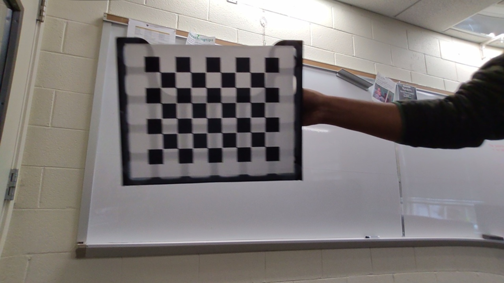
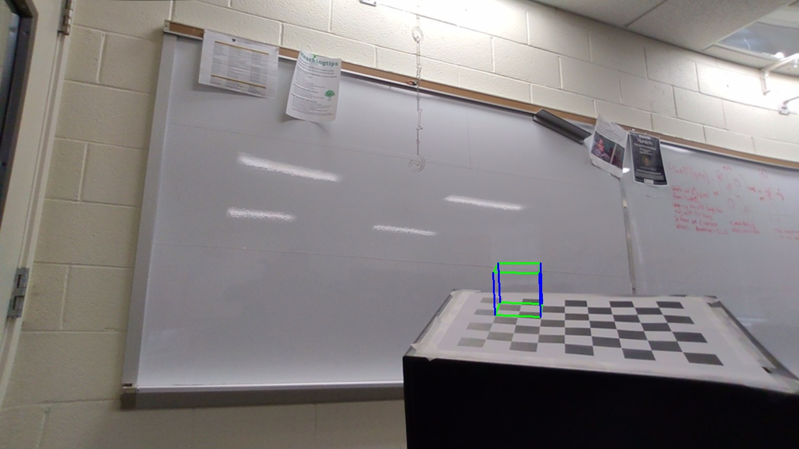
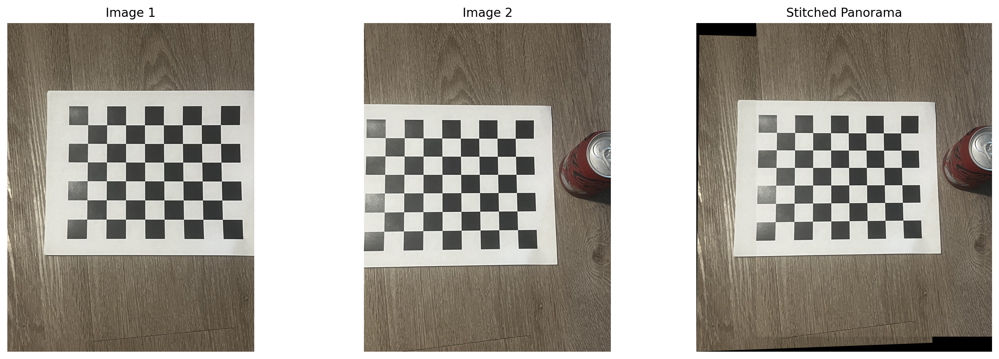

# Project 2: Geometric Applications of Calibrated Monocular Vision

This project demonstrates camera calibration and extending it to practical applications like augmented reality and image stitching.

## Phase 1: Camera Calibration

The goal of this phase is to determine the camera's intrinsic parameters: the **camera matrix (K)** and **distortion coefficients**. These parameters are essential for correcting lens distortion and accurately mapping 3D world points to 2D image pixels.

### Methodology

1.  **Data Capture**: Over 20 images of a chessboard pattern (8x6 internal corners) were captured from various angles and distances.
2.  **Corner Detection**: The function `cv2.findChessboardCorners()` was used to locate the pixel coordinates of the corners in each image.
3.  **Corner Refinement**: To improve accuracy, `cv2.cornerSubPix()` was applied to refine the corner locations to sub-pixel precision. This step is crucial for achieving a stable and accurate calibration, as it minimizes measurement errors.
4.  **Calibration**: By providing the known 3D coordinates of the chessboard corners (in its own coordinate system) and their corresponding 2D pixel locations from all images, `cv2.calibrateCamera()` computes the optimal camera matrix `K` and the lens distortion coefficients.

### Results: Distortion Correction

The calculated intrinsic parameters were used with `cv2.undistort()` to remove the visible lens distortion from a test image. The image below shows a side-by-side comparison of the original distorted image and the corrected, undistorted version.

_Original Distorted Image vs. Corrected Image_

- The lens compresses and squizes pixels at the edges inward, cramming more of the scene into a smaller space.
- The undistorted image is telling the geometric truth. To reverse the compression, it must pull those squished pixels back out to where they belong on a perfect grid.
- This necessary "de-squishing" is what we perceive as stretching, which can be observed at the buttom right.

## 

## Phase 2: Applications of Calibrated Vision

### Application 1: Calibrated Augmented Reality

We use the intrinsic matrix `K` to overlay a virtual 3D cube onto the chessboard pattern in a single image, making it appear as if the cube exists in the real world.

#### Methodology

1.  **Pose Estimation with `cv2.solvePnP`**:
    - First, the chessboard corners are detected in the target image.
    - `cv2.solvePnP` (Perspective-n-Point) is the core function used here. It takes the known 3D coordinates of the chessboard corners, their detected 2D pixel locations in the image, and the pre-calibrated camera matrix `K`.
    - Using this information, it solves for the camera's "pose"—its exact 3D position (**Translation vector, T**) and orientation (**Rotation vector, R**) relative to the chessboard.
2.  **Projection**:
    - The 3D coordinates of a virtual cube's vertices are defined relative to the chessboard's origin.
    - Using the camera's calculated pose (R, T) and its intrinsic matrix `K`, the function `cv2.projectPoints()` projects these 3D cube vertices onto the 2D image plane.
3.  **Rendering**: Lines are drawn between the projected 2D points to render the final wireframe cube on the image.

#### Results: AR Cube Overlay

The output below shows the virtual cube correctly anchored to the chessboard pattern.



#### Results: AR Cube Overlay

Using this approach, we designed a new game where we track the position of an object and mave it in the spatial position on the chessboard using keys.

```
streamlit run phase2_1_streamlit_chess_game.py
```

[Watch Chess Game Overlay](outputs/chess_overlay_proj2.mp4)

### Application 2: Non-calibrated Image Stitching

This application demonstrates how to create a panoramic image by stitching two overlapping images together. This process computes the geometric relationship between the images without prior camera calibration.

#### Methodology

1.  **Feature Detection (ORB)**: The **ORB** (Oriented FAST and Rotated BRIEF) algorithm is used to detect hundreds of unique keypoints (like corners and edges) and compute a descriptor for each one in both images. ORB is efficient and well-suited for this task.
2.  **Feature Matching**: A Brute-Force matcher is used to find pairs of keypoints that have the most similar descriptors between the two images.
3.  **Robust Homography Estimation (RANSAC)**:
    - The initial matches contain many incorrect pairings (outliers). To find the true geometric transformation, we use the **RANSAC** (Random Sample Consensus) algorithm.
    - RANSAC iteratively selects a random subset of matches and computes a candidate **Homography Matrix (H)**. A homography is a 3x3 matrix that describes how the points in one image can be transformed to align with the other, assuming they view a common plane.
    - It then tests this matrix against all matches and finds the one that is consistent with the largest number of pairs (the inliers). This process robustly rejects outliers and produces a highly accurate transformation matrix.
4.  **Warping and Stitching**: The computed Homography matrix `H` is used to warp the first image to align its perspective with the second. The two images are then blended onto a larger canvas to create the final panorama.

#### Results: Panorama

The two source images are successfully aligned and blended into a single, seamless panoramic image.


