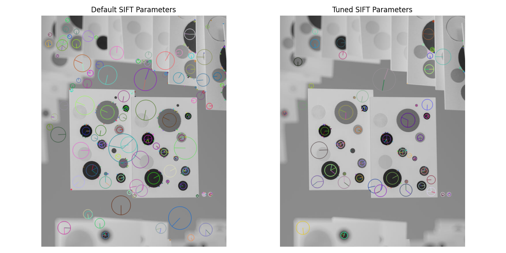
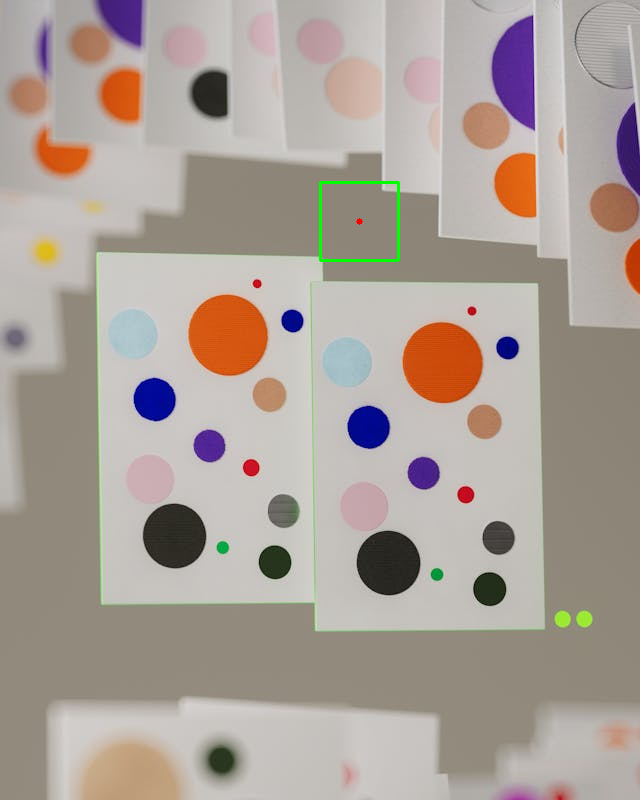
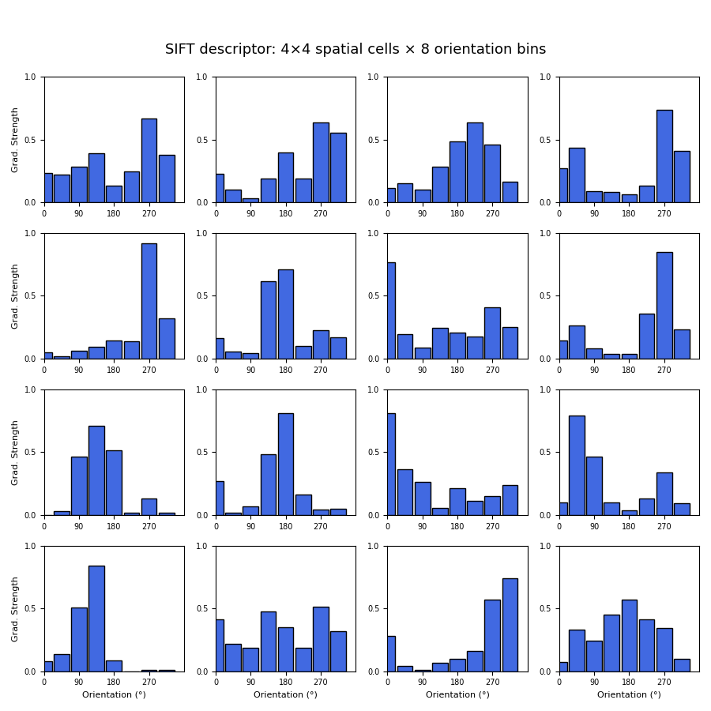
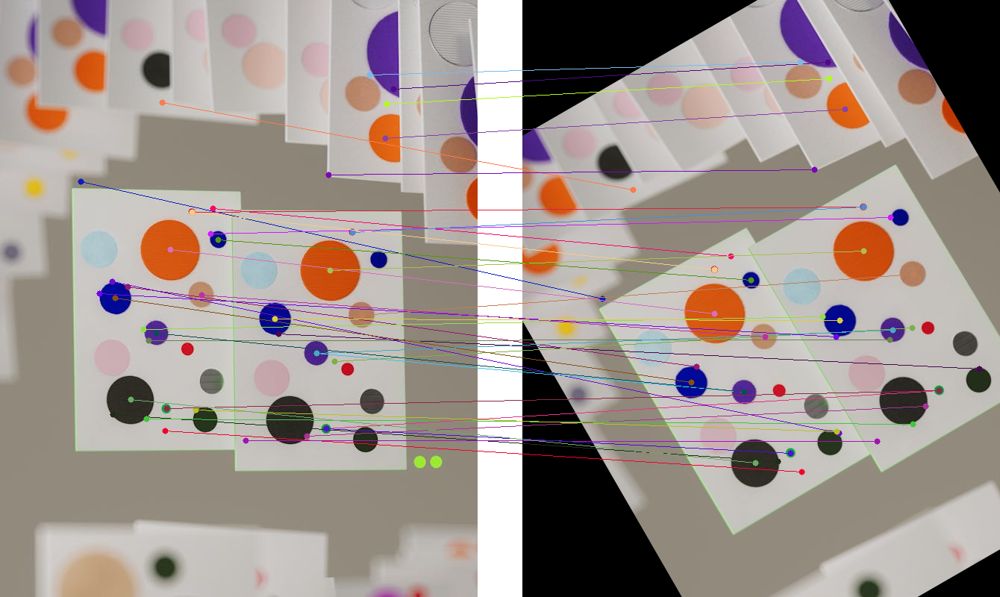
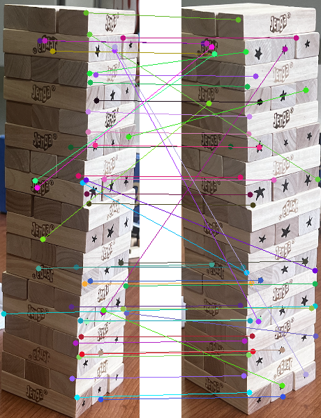

# Repository 3: SIFT Feature Analysis

This repository explores the Scale-Invariant Feature Transform (SIFT) for feature detection, description, and matching. The analysis is broken down into several parts, from basic blob detection to feature matching on custom images.

## Part 1: Blob Detection

In this section, we use the default OpenCV SIFT detector to identify keypoints (blobs) in an image. The SIFT algorithm uses the Difference of Gaussians (DoG) approach to find features that are invariant to scale and orientation.

### Default SIFT Parameters

The default parameters for the `cv2.SIFT_create()` detector are as follows:

```
Default SIFT Parameters:
  Number of Features: 0
  Contrast Threshold: 0.04
  Edge Threshold: 10
  Sigma: 1.6
  Number of Octave Layers: 3
```

## Part 2: Tuning Blob Detection Performance

The default SIFT parameters are general-purpose and not always optimal. By tuning these parameters, we can improve the quality and relevance of the detected keypoints for a specific image. The goal here was to adjust the thresholds to better capture the circular blobs in the test image.

The following parameters were adjusted:

- `contrastThreshold`: Increased from `0.04` to `0.08`. Since the blobs are separated by distinct, high-contrast colors, a higher threshold helps filter out noisy, low-contrast features.
- `nOctaveLayers`: Increased from `3` to `4` to improve the detection of smaller blobs.
- `sigma`: Increased from `1.6` to `1.8`. A slightly higher sigma value applies more initial blur, which helps reduce noise and focus on more prominent features.
- `edgeThreshold`: Kept at the default of `10`, as filtering edge-like features is still desirable.

### Comparison of Default vs. Tuned Parameters

The comparison below shows that the tuned parameters resulted in fewer (195 vs. 387) but more accurate keypoints, successfully identifying the distinct blobs while filtering out background noise.



It is clear that larger circles are being drawn for larger blob features in the image. For this particular example, I increased the default value of the `contrastThreshold` because I observed that the blobs are separated by distinct colors. Additionally, to better detect smaller blobs, I increased the number of octave layers to 4. Besides this, I used a sigma of 1.8 because there were lots of noisy keypoints in the default setting. After these parameter changes, the number of keypoints reduced to 195 from the 387 (generated by the default setting).

## Part 3: Descriptors

Once a keypoint is detected, a descriptor is computed to represent its local appearance. This descriptor is a high-dimensional vector that uniquely characterizes the feature, allowing it to be matched in other images. Each SIFT descriptor is a 128-element vector.

### Keypoint and its Image Patch

To understand what a descriptor represents, we can visualize the image patch associated with a specific keypoint. Below, the largest keypoint detected with our tuned parameters is highlighted. The green rectangle shows the local image patch from which the descriptor is computed.



### SIFT Descriptor Structure and Visualization

A **SIFT descriptor** captures the appearance around the keypoint using gradients within its local image patch.

- This patch is divided into a **4×4 grid**, creating 16 smaller cells that preserve spatial information.
- Each of these 16 cells contains an **8-bin histogram** representing edge orientations in 45° intervals (0°, 45°, ..., 315°).
- The **height of each bin** indicates the strength of the edges in that direction within that cell.
- Concatenating all 16 histograms (16 cells \* 8 bins/cell) forms the final **128-dimensional vector**.

This representation makes SIFT features robust to changes in scale, rotation, and illumination. The visualization below shows the 128-D descriptor for our selected keypoint, broken down into its 4x4 grid of 8-bin orientation histograms.



## Part 4: Feature Matching

The primary application of SIFT is to find corresponding features across different images. Here, we create a transformed version of our original image (rotated and shifted) and use a Brute-Force Matcher to find the most similar keypoints between the two. The matcher compares the descriptor of each keypoint from the first image with all descriptors from the second image and finds the best match based on Euclidean distance.

The image below visualizes the top 50 matches between the original and the transformed image. The connecting lines show that SIFT successfully identified the corresponding blobs despite the geometric transformation.



## Part 5: SIFT Matching with Custom Images (Grad Only)

To demonstrate SIFT's effectiveness in a real-world scenario, the same process was applied to two photographs of a Jenga tower taken from different perspectives. The SIFT detector was tuned to better identify features on the wooden blocks.

The visualization below shows the top 50 matches found between the two images. SIFT is able to robustly match features on the individual blocks, demonstrating its invariance to changes in viewpoint.


